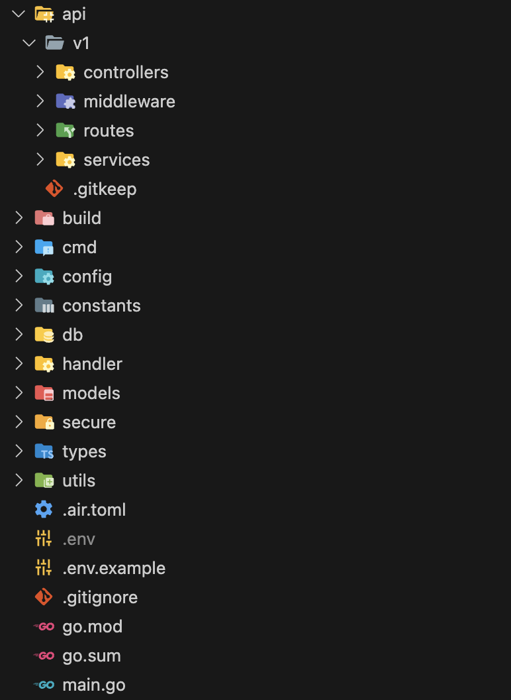

# Go REST API Boilerplate
Golang API boilerplate using GoFiber and PostgreSQL

## Folder Structure

- `/api/v1`
    - `/routes` - All API routes are defined here
    - `/controllers` - For validating requests and calling services
    - `/services` - For business logic, database calls and other services
    - `/middlewares` - For authentication, logging, rate limiting etc.

- `/build` - Contains built binary, gitignore'd
- `/cmd` - Initializes the fiber app and basic middlewares configuration
- `/config` - For handling configuration/env variables
- `/db` - For handling database connections 
- `/handlers` - For handling responses and db transactions
- `/models` - Auto generated models from database tables using [sqlboiler](https://pkg.go.dev/github.com/volatiletech/sqlboiler/v4@v4.16.1)
- `/secure` - Contains SSL certificates, gitignore'd
- `/types` - For defining custom types that can be used across the app
- `/utils` - For utility functions

- `main.go` - Entrypoint of the app

### Pro-tip
- Get beautiful folder by using Material Icon Theme in VSCode  




## How to use
1. The repo contains product API implementation for reference.

2. Clone the repo and rename the folder to your project name.

3. Search for `atharvbhadange/go-api-template` in the project and replace it with `<your-github-id/project-name>`.

4. Run `go install github.com/volatiletech/sqlboiler/v4/drivers/sqlboiler-psql@latest` to install sqlboiler for generating models.

5. Change the `models/sqlboiler.toml` file to match your database configuration.

6. Under models folder, run `sqlboiler psql` to generate models from database tables, this will create a `models` folder.

7. Copy the contents of `models/models` folder to `models` folder in the root of the project.

8. Run `go mod tidy` to install all the dependencies.

9. Copy `.env.example` to `.env` and change the values as per your configuration.

10. Run `go build -o ./build/main && ./build/main` to build and run the app.


## Optional
1. Run `go get github.com/cosmtrek/air` to install air for hot reloading.

2. Run `air` to start the app with hot reloading.


## Notes
- `Success` Handler for successful requests

- `BuildError` Handler for build errors

- Start new PGX trx from `controllers` only

- `/api/v1` is the base path for all routes except `/` for health check

- `/models` can live as a separate repo and can be imported as a git submodule

- To run the sample product API implementation, create a table called `products` using the following query:
```sql
CREATE TABLE IF NOT EXISTS products (
  id SERIAL PRIMARY KEY,
  name varchar(255) NOT NULL,
  description text NOT NULL,
  price int NOT NULL,
  created timestamp NOT NULL,
  modified timestamp NOT NULL DEFAULT CURRENT_TIMESTAMP
);
```
